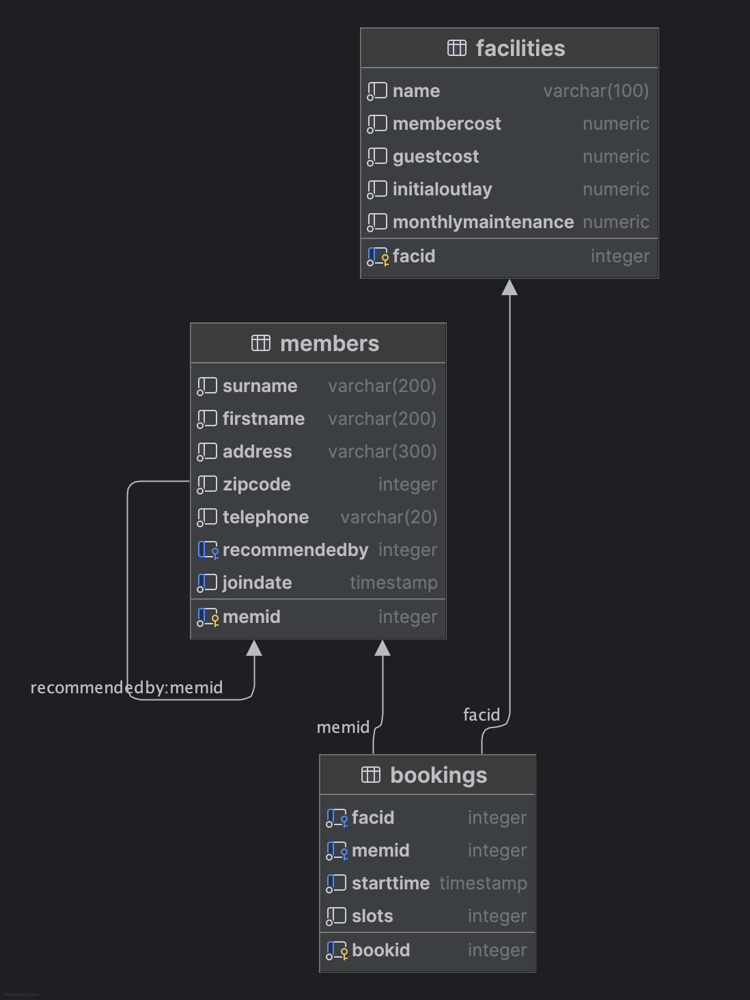

# Project Documentation

## Overview

This project involves working with SQL databases to retrieve and manipulate data from various tables. The primary focus
is on querying data from the `cd` schema, which includes tables such as `facilities`, `members`, and `bookings`.

## Database Diagram



## Files

### SQL Files

#### `basic.sql`

This file contains basic SQL queries to retrieve and manipulate data from the `cd` schema.

#### `joins_and_subqueries.sql`

This file contains SQL queries that involve joining multiple tables to retrieve complex data sets.

#### `modifying_data.sql`

This file contains SQL queries that involve modifying data in the `cd` schema, such as inserting, updating, and deleting records.

#### `data.sql`

This file contains SQL queries to create the schema and insert initial data into the `cd` schema tables.

### Other Files

#### `exercises.drawio`

This file contains the database diagram in draw.io format.

#### `exercises.md`

This file contains markdown documentation for the exercises.

#### `docker-compose.yml`

This file contains the Docker Compose configuration to set up the PostgreSQL database for the project.

## Usage

To run the SQL queries, you can use any SQL client that supports PostgreSQL. Simply copy and paste the queries into your
SQL client and execute them against the appropriate database.

To set up the PostgreSQL database using Docker Compose, run the following command in the terminal:

```sh
docker-compose up
```